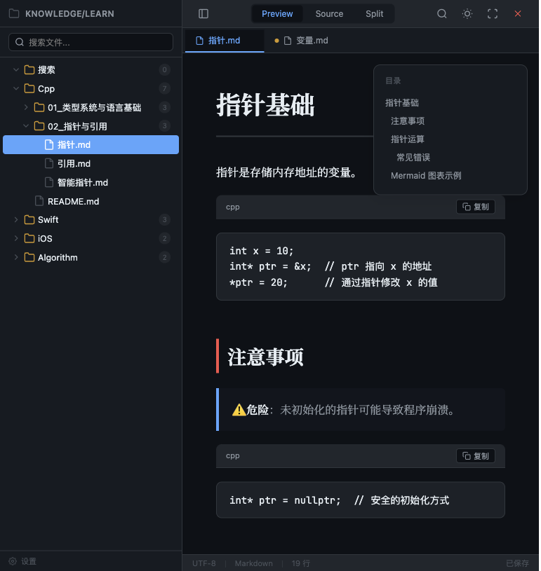
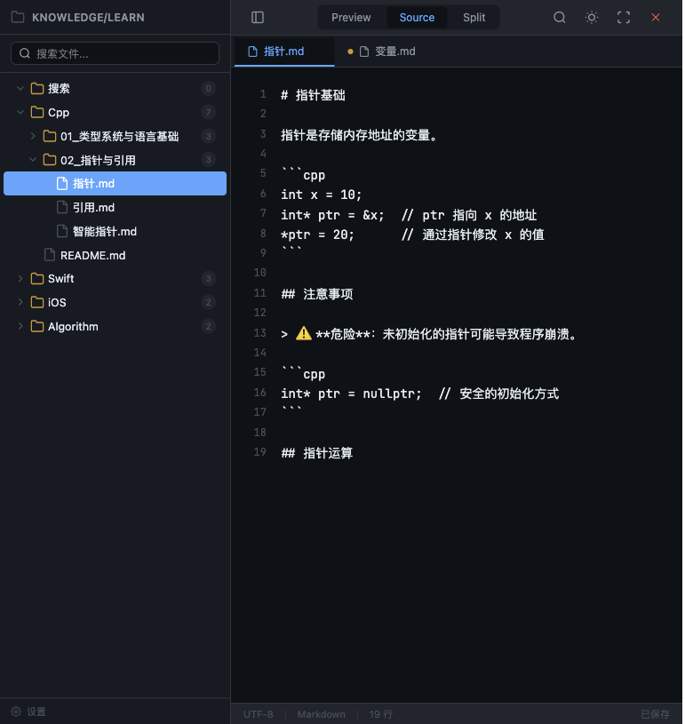
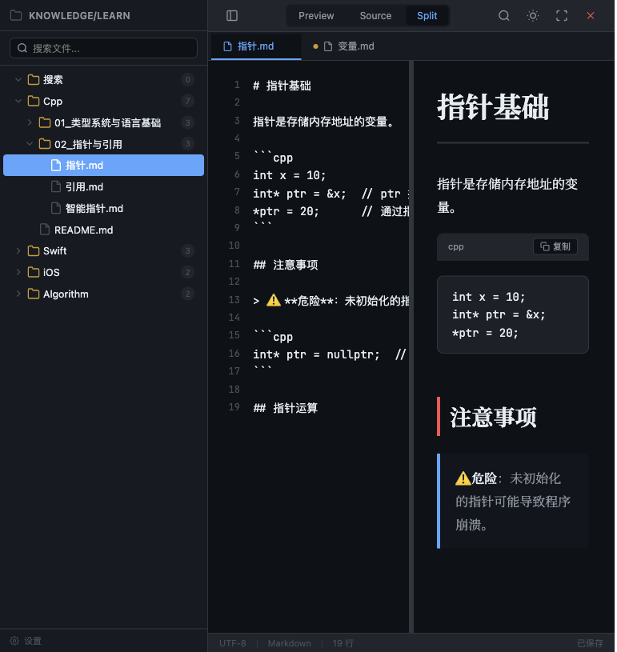

# MKPreview

> 跨平台 Markdown 知识库精美渲染与浏览桌面应用

MKPreview 是一款面向**技术知识库管理场景**的跨平台桌面应用（macOS + Windows），核心解决「大规模 Markdown 知识库的精美渲染浏览与轻量编辑」问题。

与通用 Markdown 编辑器不同，MKPreview 的设计原点是 **「阅读优先、目录驱动」**——让拥有数百篇深度技术文章的 Markdown 知识库，以「精品书籍」品质呈现出来。

---

## ✨ 核心特性

- **📂 文件树浏览** — 递归扫描目录，按数字前缀自然排序，支持虚拟滚动、搜索过滤
- **🎨 精美渲染引擎** — 基于 markdown-it，提供出版级排版质量的 Markdown 渲染
- **📐 三种显示模式** — 预览模式、源码模式、分屏模式（快捷键 `Cmd/Ctrl+1/2/3` 切换）
- **🌙 亮暗主题** — 支持跟随系统主题 + 手动切换，15+ 套精美 Markdown 渲染主题
- **🔢 代码语法高亮** — highlight.js 覆盖 180+ 语言，带语言标签、行号、一键复制
- **📊 Mermaid 图表** — 原生支持 flowchart、sequence diagram、Gantt 等多种图表
- **∑ KaTeX 公式** — 行内 `$...$` 和块级 `$$...$$` 数学公式渲染
- **🖼️ 图片 Lightbox** — 点击图片放大查看，支持缩放与拖拽
- **📑 多标签页** — 同时打开多个文件，通过标签栏快捷切换
- **🔍 全文搜索** — 文件名模糊匹配 + 文件内容全文搜索
- **📋 目录大纲** — 自动从 H1-H6 标题生成 TOC 浮动面板，点击跳转
- **✏️ 轻量编辑** — CodeMirror 6 编辑器，支持自动保存、快捷键（Phase 2）
- **🔄 文件监听** — Rust `notify` crate 实时监控目录变更，自动刷新文件树
- **🌐 国际化** — 支持中文 / English 界面切换

---

## 🖥️ 界面预览

<div align="center">
  <table>
    <tr>
      <td></td>
      <td></td>
    </tr>
    <tr>
      <td align="center">预览模式 - 亮色</td>
      <td align="center">预览模式 - 暗色</td>
    </tr>
    <tr>
      <td></td>
      <td></td>
    </tr>
    <tr>
      <td align="center">源码模式 - 暗色</td>
      <td align="center">分屏模式 - 暗色</td>
    </tr>
  </table>
</div>

---

## 🛠️ 技术栈

| 层 | 选型 |
|----|------|
| **应用框架** | [Tauri 2.0](https://v2.tauri.app/)（Rust + 系统 WebView） |
| **前端框架** | [Vue 3](https://vuejs.org/) + [TypeScript](https://www.typescriptlang.org/) |
| **状态管理** | [Pinia](https://pinia.vuejs.org/) |
| **Markdown 解析** | [markdown-it](https://github.com/markdown-it/markdown-it) |
| **代码编辑器** | [CodeMirror 6](https://codemirror.net/) |
| **代码高亮** | [highlight.js](https://highlightjs.org/)（180+ 语言） |
| **图表渲染** | [mermaid.js](https://mermaid.js.org/) |
| **数学公式** | [KaTeX](https://katex.org/) |
| **构建工具** | [Vite](https://vitejs.dev/) |
| **样式系统** | [Tailwind CSS](https://tailwindcss.com/) + 自定义 Markdown 主题 CSS |
| **文件监控** | Rust [`notify`](https://docs.rs/notify) crate |
| **国际化** | [vue-i18n](https://vue-i18n.intlify.dev/) |

---

## 📁 项目结构

```
mkpreview/
├── src-tauri/                  # Rust 后端 (Tauri)
│   ├── src/
│   │   ├── main.rs             # 入口
│   │   ├── lib.rs              # 模块注册 + 菜单栏定义
│   │   ├── commands/           # IPC 命令（文件系统、搜索、设置、监控）
│   │   ├── services/           # 业务服务（目录扫描、文件监听、配置存储）
│   │   └── models/             # 数据结构（FileTreeNode、SearchResult 等）
│   ├── capabilities/           # Tauri 2.0 权限声明
│   ├── icons/                  # 应用图标
│   └── tauri.conf.json         # Tauri 应用配置
│
├── src/                        # Vue 3 前端
│   ├── App.vue                 # 根组件
│   ├── main.ts                 # Vue 入口
│   ├── components/
│   │   ├── layout/             # 布局骨架（AppLayout、Toolbar、Sidebar 等）
│   │   ├── file-tree/          # 文件树组件
│   │   ├── tabs/               # 标签栏组件
│   │   ├── editor/             # 代码编辑器封装
│   │   ├── preview/            # Markdown 预览组件
│   │   ├── split/              # 分屏模式
│   │   ├── search/             # 全局搜索
│   │   ├── settings/           # 设置面板
│   │   └── common/             # 通用组件
│   ├── composables/            # Vue 3 组合式函数
│   ├── stores/                 # Pinia 状态管理
│   ├── services/               # Tauri IPC 封装
│   ├── lib/                    # 工具库（markdownIt、highlighter、mermaid 等）
│   ├── types/                  # TypeScript 类型定义
│   ├── i18n/                   # 国际化（zh-CN / en-US）
│   └── assets/                 # 静态资源（样式、字体）
│
├── design/                     # 设计文档
├── prd/                        # 产品需求文档
├── scripts/                    # 构建辅助脚本
└── package.json
```

---

## 🚀 快速开始

### 前置条件

- [Node.js](https://nodejs.org/) >= 18（推荐使用 `.nvmrc` 中版本）
- [Rust](https://www.rust-lang.org/) >= 1.70
- [Tauri 2.0 系统依赖](https://v2.tauri.app/start/prerequisites/)

### 安装依赖

```bash
# 安装前端依赖
npm install

# 安装 Tauri CLI
npm install -g @tauri-apps/cli
```

### 开发模式

```bash
# 启动 Tauri 开发服务器（前端热更新 + Rust 后端）
npm run tauri:dev
```

Vite 开发服务器运行在 `http://localhost:5173`，Tauri 窗口打开后自动连接到该地址。

### 构建

```bash
# macOS（通用构建）
npm run tauri:build:mac

# macOS（Universal Binary，同时支持 Intel + Apple Silicon）
npm run tauri:build:mac:universal

# Windows
npm run tauri:build:win:x64

# Linux
npm run tauri:build:linux
```

---

## 🧪 测试

```bash
# 运行单元测试
npm test

# 运行测试 UI
npm run test:ui
```

---

## 📦 分发

- **macOS**: `.dmg` / `.app` 安装包，支持 Universal Binary
- **Windows**: `.msi` / `.exe` 安装包
- **Linux**: `.deb` / `.AppImage` 安装包

安装包体积目标 < 15MB，无需额外运行时依赖。

---

## 🏗️ 架构概览

### 三层分层架构

```
┌─────────────────────────────────────────────────┐
│              渲染层（WebView）                     │
│  markdown-it ｜ mermaid.js ｜ highlight.js │ KaTeX │
│  CSS 主题系统（light / dark）                    │
└────────────────┬────────────────────────────────┘
                 │ Tauri IPC (invoke / event)
┌────────────────▼────────────────────────────────┐
│             前端层（Vue 3 + Pinia）                │
│  文件树组件 ｜ 分栏布局 ｜ 三模式切换 ｜ 标签页管理 │
└────────────────┬────────────────────────────────┘
                 │ Tauri IPC
┌────────────────▼────────────────────────────────┐
│             后端层（Rust / Tauri Core）            │
│  文件系统服务 ｜ 目录监控 ｜ 配置持久化            │
└─────────────────────────────────────────────────┘
```

### 渲染流水线

Markdown 渲染采用四阶段管线设计：

1. **Stage 1**: markdown-it 核心解析（tokenize → parse → render HTML）
2. **Stage 2**: DOM 注入（将 HTML 插入渲染容器）
3. **Stage 3**: 并行后处理（highlight.js 高亮 + Mermaid 渲染 + 图片路径解析）
4. **Stage 4**: CSS 主题应用 + 交互增强（复制按钮、Lightbox、TOC、同步滚动）

---

## 📚 设计文档

项目详细设计文档位于 [`design/`](design/) 目录，涵盖：

| 模块 | 文档 |
|------|------|
| 应用布局 | [grid-layout](design/app-layout/grid-layout.md)、[resizer](design/app-layout/grid-resizer.md)、[toolbar](design/app-layout/toolbar.md) 等 |
| Markdown 引擎 | [md-core-config](design/markdown-engine/md-core-config.md)、[code-block](design/markdown-engine/code-block.md)、[mermaid-render](design/markdown-engine/mermaid-render.md) 等 |
| 文件树 | [tree-core](design/file-tree/tree-core.md)、[tree-virtual-scroll](design/file-tree/tree-virtual-scroll.md) 等 |
| 文件服务 | [dir-scanner](design/backend-fileservice/dir-scanner.md)、[file-watcher](design/backend-fileservice/file-watcher.md) 等 |
| 主题设置 | [theme-system](design/theme-settings/theme-system.md)、[settings-panel](design/theme-settings/settings-panel.md) 等 |

---

## 📄 许可证

版权所有 © 2026 MKPreview Team

---

## 🤝 贡献

本项目为个人知识库管理工具，欢迎提交 Issue 和 PR。
