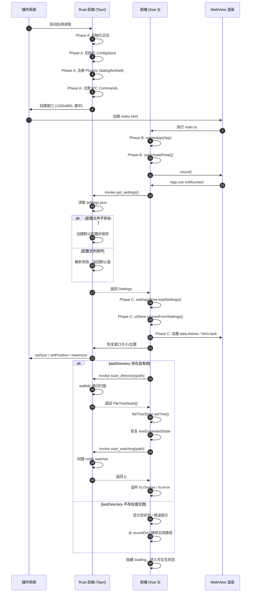

# F01-03 应用启动流程 (Project Startup Flow)

> 模块：scaffold | 优先级：P0-MVP | 依赖：F01-01, F01-02, F02-05

## 1. 功能描述与目标

本特性定义 MKPreview 从进程启动到用户可完全交互的完整初始化流程，串联 Rust 后端启动钩子、前端应用挂载、配置持久化恢复、窗口状态还原以及工作区（目录 + 文件树 + 监控）重建五个阶段。

**核心目标**：
- 确保应用在冷启动后 1.5s 内进入可交互状态（首屏渲染完成、用户可操作文件树和工具栏）
- 应用重启时完整恢复用户偏好（主题、字体、侧边栏宽度、窗口尺寸）
- 应用重启时自动恢复上次打开的工作区目录和文件树展开状态
- 启动过程中任何阶段失败均具备降级策略，不阻塞应用进入可用状态

**关联需求**：FR-001.7（记住上次目录）、FR-007（主题恢复）、NFR-001（启动性能）

---

## 2. 技术实现方案

### 2.1 启动时序（分阶段）

#### Phase A: Rust 后端初始化（Tauri `setup` hook）

在 `src-tauri/src/lib.rs` 的 `tauri::Builder::default().setup(|app| { ... })` 闭包中同步执行：

1. **初始化日志系统**
   - 配置 `env_logger` 或 `tauri::log`，设置日志级别为 `info`（开发模式可下调至 `debug`）
   - 日志输出到系统标准日志通道（macOS: Console.app, Windows: Event Viewer / stderr）

2. **初始化配置存储**
   - 通过 `app.path().app_data_dir()` 获取应用数据目录
   - 检查目录是否存在，不存在则 `create_dir_all`
   - 调用 `ConfigStore::init(app_data_dir)` 预热配置存储实例
   - 若 `settings.json` 不存在，由 `ConfigStore` 自动创建并写入默认配置（见 F02-05）

3. **注册所有 Tauri plugins**
   - `tauri_plugin_dialog::init()` — 系统文件对话框
   - `tauri_plugin_fs::init()` — 文件系统访问
   - `tauri_plugin_shell::init()` — 外部链接打开

4. **注册所有 IPC commands**
   - 通过 `invoke_handler(tauri::generate_handler![...])` 注册全部 Command：
     - `scan_directory`（F02-01）
     - `read_file`、`write_file`、`get_file_meta`（F02-02）
     - `start_watching`、`stop_watching`（F02-03）
     - `search_files`（F02-04，Phase 2）
     - `get_settings`、`save_settings`（F02-05）
     - `open_directory_dialog`（F02-01）

> **注意**：`setup` hook 中不得执行耗时操作（如目录扫描、大量文件 IO），所有可能阻塞的恢复逻辑移交到前端触发，以保证窗口尽快绘制。

#### Phase B: 前端初始化（`main.ts`）

WebView 加载 `index.html` → 执行 `src/main.ts`，按以下顺序初始化：

1. **创建 Vue 3 应用实例**
   ```typescript
   const app = createApp(App)
   ```

2. **安装 Pinia 状态管理**
   ```typescript
   app.use(createPinia())
   ```

3. **挂载应用**
   ```typescript
   app.mount('#app')
   ```
   此时 `App.vue` 渲染空骨架或加载动画，用户看到应用窗口内容区。

4. **Store 实例化顺序（关键）**
   Pinia Store 在首次 `useStore()` 时实例化。启动流程中通过 `App.vue` 的 `onMounted` 或一个专用的 `useStartup()` composable 按以下顺序触发初始化：
   - `settingsStore` — 最先初始化，因为其他 Store 可能依赖配置值
   - `uiStore` — 依赖 `settingsStore` 中的 `sidebarWidth`、`windowState`
   - `fileTreeStore` — 依赖 `settingsStore` 中的 `lastDirectory`、`treeExpandedState`
   - `tabStore` — 最后初始化，依赖文件树就绪后恢复打开的文件

#### Phase C: 配置加载与状态恢复

在 `App.vue` 挂载后的异步初始化函数（如 `initializeApp()`）中执行：

1. **调用 `get_settings` 获取持久化配置**
   ```typescript
   const settings = await invoke<Settings>('get_settings')
   ```
   - 首次启动时返回 `Settings::default()`，同时后端自动创建 `settings.json`
   - 若 `settings.json` 损坏（JSON 解析失败），后端返回默认值并记录错误日志

2. **settingsStore 加载配置**
   ```typescript
   settingsStore.loadSettings(settings)
   ```
   加载项包括：
   - `theme` → 决定应用主题模式（`system` / `light` / `dark`）
   - `fontSize`、`codeFontSize` → CSS 变量 `--font-size-body`、`--font-size-code`
   - `fontBody`、`fontCode` → CSS 变量 `--font-body`、`--font-mono`
   - `showLineNumbers` → 编辑器行号显示状态
   - `autoSave`、`autoSaveInterval` → 自动保存开关与间隔
   - `recentDirs` → 最近打开目录列表（用于"文件 → 最近目录"菜单）

3. **uiStore 恢复 UI 状态**
   ```typescript
   uiStore.restoreFromSettings(settings)
   ```
   恢复项包括：
   - `sidebarWidth` → 设置 CSS 变量 `--sidebar-width`，默认 260px
   - `treeExpandedState` → 文件树展开状态映射表（路径 → 是否展开）
   - `splitRatio` → 分屏模式左右比例（Phase 2）

4. **应用主题**
   - 若 `theme === 'system'`：读取 `window.matchMedia('(prefers-color-scheme: dark)')`，匹配则应用 dark
   - 若 `theme === 'light'` 或 `'dark'`：直接应用对应主题
   - 应用方式：设置 `<html>` 元素的 `data-theme="dark"` 或 `"light"`，触发 CSS 变量切换
   - 同时同步 Tailwind 的 `dark` 类（`document.documentElement.classList.toggle('dark', isDark)`）

#### Phase D: 窗口恢复

在 Phase C 之后，通过 Tauri Window API 恢复窗口几何状态：

```typescript
import { getCurrentWindow } from '@tauri-apps/api/window'

const window = getCurrentWindow()
const ws = settings.windowState

if (ws.maximized) {
  await window.maximize()
} else {
  await window.setSize(new LogicalSize(ws.width, ws.height))
  // 仅当坐标在有效显示器范围内才恢复位置
  if (isPositionOnScreen(ws.x, ws.y)) {
    await window.setPosition(new LogicalPosition(ws.x, ws.y))
  }
}
```

- **尺寸恢复**：使用 `windowState.width` / `height`，默认 1200x800，最小限制 800x600
- **位置恢复**：校验窗口坐标是否位于当前可用屏幕区域内，防止因显示器布局变更导致窗口跑到不可见区域
- **最大化恢复**：若上次关闭时窗口为最大化状态，直接调用 `maximize()`

> **MVP 简化方案**：若暂不使用 `plugin-window-state`，可在 `save_settings` 时手动将 `WindowState` 写入 `Settings`，启动时通过上述逻辑手动恢复。

#### Phase E: 工作区恢复（如果有上次打开的目录）

检查 `settings.lastDirectory`：

1. **若 `lastDirectory` 为 `None` 或空字符串**
   - 不执行目录扫描
   - 文件树面板显示空状态提示（"请选择或拖拽一个 Markdown 知识库目录"）
   - 等待用户通过 `Cmd/Ctrl+O` 或拖拽选择目录

2. **若 `lastDirectory` 存在且路径有效**
   - 显示文件树区域 loading 状态（旋转指示器）
   - 调用 `scan_directory` 扫描目录：
     ```typescript
     const treeNodes = await invoke<FileTreeNode[]>('scan_directory', {
       path: settings.lastDirectory
     })
     ```
   - `fileTreeStore.setTree(treeNodes)` 构建文件树数据结构
   - 根据 `settings.treeExpandedState` 恢复各级目录的展开/折叠状态
   - 调用 `start_watching` 启动文件系统监控：
     ```typescript
     await invoke('start_watching', { path: settings.lastDirectory })
     ```
   - 注册 `fs:change` 和 `fs:error` 事件监听器，绑定到 `fileTreeStore` 的增量更新逻辑
   - （Phase 2）恢复上次打开的文件标签页：遍历 `tabStore.savedTabs`，对每个文件调用 `read_file` 加载内容，重建标签页列表并恢复滚动位置

3. **若 `lastDirectory` 存在但路径已无效（目录被删除或移动）**
   - `scan_directory` 返回 `IoError` 或 `NotADirectory`
   - 前端捕获错误，降级处理：
     - 清空 `fileTreeStore`，显示"上次打开的目录已不存在"
     - 从 `settings.recentDirs` 中移除该目录
     - 等待用户重新选择目录

---

### 2.2 启动时序图



---

### 2.3 错误处理与降级

| 阶段 | 失败场景 | 降级策略 | 用户体验 |
|------|---------|---------|---------|
| Phase A | 应用数据目录无写入权限 | 日志记录错误；配置存储降级为仅内存模式（不持久化） | 应用可启动，但设置不会保存，关闭时提示用户 |
| Phase C | `settings.json` 损坏（非法 JSON） | 后端 `get_settings` 返回 `Settings::default()`；保留原文件为 `settings.json.bak` | 应用以默认主题/字体启动，用户不会察觉崩溃 |
| Phase C | `settings.json` 字段缺失 | 缺失字段使用 `serde(default)` 默认值 | 正常启动，缺失的配置项使用默认行为 |
| Phase D | 窗口坐标超出当前屏幕范围 | 忽略位置恢复，仅恢复窗口尺寸并居中 | 窗口正常显示在主显示器中央 |
| Phase E | `lastDirectory` 目录不存在 | 清空 `fileTreeStore`；toast 提示"上次目录已失效"；更新 `recentDirs` 过滤掉失效项 | 文件树区域显示空状态，等待用户重新选择目录 |
| Phase E | `scan_directory` 超时 (> 5s) | 前端显示"正在加载大型知识库..."提示；后台继续扫描；扫描完成后刷新文件树 | 用户不会被阻塞，可感知加载进度 |
| Phase E | `scan_directory` 返回 IoError（权限不足） | 同"目录不存在"降级策略 | 提示权限不足，引导用户选择其他目录 |
| Phase E | `start_watching` 创建失败 | 文件树正常展示；toast 提示"实时更新已禁用"；`fileTreeStore.isWatching = false` | 用户仍可浏览和阅读，但外部文件变更不会自动刷新 |
| Phase E | `fs:change` 事件处理异常 | 前端捕获异常，不阻断后续事件处理；记录错误日志 | 文件树更新可能遗漏单次变更，但应用不崩溃 |

---

### 2.4 性能目标

| 指标 | 目标值 | 测试方法 | 归属阶段 |
|------|--------|---------|---------|
| 冷启动到首屏可交互 | < 1.5s | 从双击应用到文件树可点击计时 | A ~ E 全流程 |
| Rust setup hook 耗时 | < 100ms | hook 内 `Instant::elapsed` 统计 | Phase A |
| WebView 首帧渲染 | < 500ms | DevTools Performance 中 First Paint | Phase B |
| 配置加载 | < 50ms | `get_settings` invoke 往返耗时 | Phase C |
| 主题应用无闪烁 | 0ms 白屏 | 主题 CSS 在 `global.css` 中同步加载，通过 `data-theme` 切换 | Phase C |
| 窗口恢复 | < 50ms | Tauri window API 调用耗时 | Phase D |
| 文件树扫描 250 文件 / 100 目录 | < 200ms | `scan_directory` invoke 往返耗时 | Phase E |
| 工作区总恢复（含扫描 + watcher） | < 500ms | 从 `lastDirectory` 判定到文件树渲染完成 | Phase E |

**关键优化策略**：
- `settings.json` 保持精简（< 50KB），避免大型 JSON 解析开销
- `scan_directory` 在 Rust 端使用 `walkdir` 同步遍历 + `serde` 序列化，单次 IPC 往返完成
- 文件树渲染采用虚拟滚动（见 F04-03），即使扫描返回 1000+ 节点，DOM 渲染仍保持轻量
- `start_watching` 与 `scan_directory` 并行发起（二者无依赖），减少串行等待

---

## 3. 接口定义

### 3.1 启动流程涉及的 IPC Command

| 命令名 | 参数 | 返回 | 调用时机 | 说明 |
|--------|------|------|---------|------|
| `get_settings` | `()` | `Settings` | Phase C | 读取持久化配置，失败时返回默认值 |
| `scan_directory` | `{ path: string }` | `FileTreeNode[]` | Phase E | 递归扫描目录构建文件树 |
| `start_watching` | `{ path: string }` | `()` | Phase E | 对目录启动 notify 监控 |
| `read_file` | `{ path: string }` | `string` | Phase E（P2） | 恢复上次打开的文件内容 |
| `open_directory_dialog` | `()` | `Option<string>` | 用户交互 | 系统目录选择对话框 |
| `save_settings` | `{ settings: Settings }` | `()` | 配置变更时 | 保存用户配置（原子写入） |

### 3.2 启动流程涉及的事件（Rust → Frontend）

| 事件名 | 载荷类型 | 触发时机 | 前端处理 |
|--------|---------|---------|---------|
| `fs:change` | `FsChangeEvent` | 监控目录下 `.md` 文件发生创建/修改/删除/重命名 | `fileTreeStore.handleFsChange(payload)` |
| `fs:error` | `FsErrorEvent` | Watcher 创建失败、运行时断开、根目录被删除 | 显示 toast 提示；`fileTreeStore.isWatching = false` |

### 3.3 前端 Store 初始化接口

```typescript
// stores/settingsStore.ts
export const useSettingsStore = defineStore('settings', () => {
  // Phase C 调用：从 get_settings 返回值加载全部配置
  function loadSettings(raw: Settings): void
  // 配置变更时调用，触发 save_settings IPC
  async function persist(): Promise<void>
})

// stores/uiStore.ts
export const useUiStore = defineStore('ui', () => {
  // Phase C 调用：从 Settings 恢复 sidebarWidth、treeExpandedState 等
  function restoreFromSettings(settings: Settings): void
})

// stores/fileTreeStore.ts
export const useFileTreeStore = defineStore('fileTree', () => {
  // Phase E 调用：设置完整树数据
  function setTree(nodes: FileTreeNode[]): void
  // Phase E 调用：从 Settings.treeExpandedState 恢复展开状态
  function restoreExpandedState(state: Record<string, boolean>): void
  // fs:change 事件回调
  function handleFsChange(event: FsChangeEvent): void
})

// stores/tabStore.ts
export const useTabStore = defineStore('tab', () => {
  // Phase E（P2）调用：恢复标签页列表和滚动位置
  function restoreTabs(tabs: SavedTab[]): void
})
```

---

## 4. 数据结构

### 4.1 Rust — Settings（完整配置结构）

```rust
// src-tauri/src/models/settings.rs

use serde::{Deserialize, Serialize};
use std::collections::HashMap;

#[derive(Debug, Clone, Serialize, Deserialize, Default)]
#[serde(rename_all = "lowercase")]
pub enum ThemePreference {
    #[default]
    System,
    Light,
    Dark,
}

#[derive(Debug, Clone, Serialize, Deserialize)]
#[serde(rename_all = "camelCase")]
pub struct WindowState {
    pub width: u32,
    pub height: u32,
    pub x: i32,
    pub y: i32,
    pub maximized: bool,
}

impl Default for WindowState {
    fn default() -> Self {
        Self {
            width: 1200,
            height: 800,
            x: 0,
            y: 0,
            maximized: false,
        }
    }
}

#[derive(Debug, Clone, Serialize, Deserialize)]
#[serde(rename_all = "camelCase")]
pub struct Settings {
    #[serde(default)]
    pub theme: ThemePreference,
    #[serde(default = "default_font_size")]
    pub font_size: u8,
    #[serde(default = "default_code_font_size")]
    pub code_font_size: u8,
    #[serde(default)]
    pub recent_directories: Vec<String>,
    #[serde(default)]
    pub last_directory: Option<String>,
    #[serde(default)]
    pub tree_expanded_state: HashMap<String, bool>,
    #[serde(default)]
    pub window_state: WindowState,
    #[serde(default = "default_sidebar_width")]
    pub sidebar_width: u16,
    #[serde(default = "default_true")]
    pub show_line_numbers: bool,
    #[serde(default = "default_false")]
    pub auto_save: bool,
    #[serde(default = "default_auto_save_interval")]
    pub auto_save_interval: u16,
}

impl Default for Settings {
    fn default() -> Self {
        Self {
            theme: ThemePreference::default(),
            font_size: default_font_size(),
            code_font_size: default_code_font_size(),
            recent_directories: Vec::new(),
            last_directory: None,
            tree_expanded_state: HashMap::new(),
            window_state: WindowState::default(),
            sidebar_width: default_sidebar_width(),
            show_line_numbers: default_true(),
            auto_save: default_false(),
            auto_save_interval: default_auto_save_interval(),
        }
    }
}

fn default_font_size() -> u8 { 16 }
fn default_code_font_size() -> u8 { 14 }
fn default_sidebar_width() -> u16 { 260 }
fn default_true() -> bool { true }
fn default_false() -> bool { false }
fn default_auto_save_interval() -> u16 { 3 }
```

### 4.2 TypeScript — Settings（前端镜像）

```typescript
// src/types/settings.ts

export type ThemeMode = 'system' | 'light' | 'dark';

export interface WindowState {
  width: number;
  height: number;
  x: number;
  y: number;
  maximized: boolean;
}

export interface Settings {
  theme: ThemeMode;
  fontSize: number;
  codeFontSize: number;
  recentDirectories: string[];
  lastDirectory: string | null;
  treeExpandedState: Record<string, boolean>;
  windowState: WindowState;
  sidebarWidth: number;
  showLineNumbers: boolean;
  autoSave: boolean;
  autoSaveInterval: number;
}

export const DEFAULT_SETTINGS: Settings = {
  theme: 'system',
  fontSize: 16,
  codeFontSize: 14,
  recentDirectories: [],
  lastDirectory: null,
  treeExpandedState: {},
  windowState: {
    width: 1200,
    height: 800,
    x: 0,
    y: 0,
    maximized: false,
  },
  sidebarWidth: 260,
  showLineNumbers: true,
  autoSave: false,
  autoSaveInterval: 3,
};
```

### 4.3 TypeScript — 启动流程专用类型

```typescript
// src/types/startup.ts

/**
 * 启动阶段枚举 — 用于前端 loading UI 状态展示
 */
export type StartupPhase =
  | 'initializing'      // Phase A/B: 应用初始化
  | 'loading-config'    // Phase C: 加载配置
  | 'restoring-window'  // Phase D: 恢复窗口
  | 'loading-workspace' // Phase E: 加载工作区
  | 'ready';            // 启动完成

/**
 * 启动状态快照 — 供 Splash / Loading 组件绑定
 */
export interface StartupState {
  phase: StartupPhase;
  progress: number;        // 0 ~ 100
  message: string;         // 当前阶段提示文本
  error?: string;          // 若某阶段降级，记录降级原因
}

/**
 * Phase E 恢复工作区的中间状态
 */
export interface WorkspaceRestoreState {
  directory: string;
  isScanning: boolean;
  scanError?: string;
  isWatching: boolean;
  watchError?: string;
}
```

### 4.4 核心数据结构关系图

```
Settings
├── theme: ThemePreference
├── fontSize: u8
├── codeFontSize: u8
├── recentDirectories: String[]
├── lastDirectory: Option<String>
├── treeExpandedState: HashMap<String, bool>
├── windowState: WindowState
│   ├── width: u32
│   ├── height: u32
│   ├── x: i32
│   ├── y: i32
│   └── maximized: bool
├── sidebarWidth: u16
├── showLineNumbers: bool
├── autoSave: bool
└── autoSaveInterval: u16

FileTreeNode
├── name: String
├── path: String
├── isDir: bool
├── children?: FileTreeNode[]
└── fileCount?: usize

FsChangeEvent
├── changeType: FsChangeType
├── path: String
├── oldPath?: String
└── isDir: bool
```

---

## 5. 依赖关系

### 5.1 前置依赖

| 特性编号 | 特性名 | 说明 |
|---------|--------|------|
| F01-01 | Tauri + Vue 项目初始化 | 提供 `lib.rs` setup hook、IPC 注册框架、Pinia 安装 |
| F01-02 | 前端基础配置 | 提供 `main.ts` 入口、CSS 变量主题基础设施、`@/` 路径别名 |
| F02-05 | 配置持久化服务 | 提供 `get_settings` / `save_settings` Command 和 `ConfigStore` |

### 5.2 本特性依赖的后端服务（需在启动前实现）

| 服务模块 | 来源特性 | 启动中使用场景 |
|---------|---------|--------------|
| `ConfigStore` | F02-05 | Phase A 预热、Phase C 配置读取 |
| `scan_directory` | F02-01 | Phase E 恢复工作区目录树 |
| `start_watching` | F02-03 | Phase E 启动文件监控 |
| `read_file` | F02-02 | Phase E（P2）恢复打开的文件内容 |

### 5.3 后置被依赖

| 特性编号 | 特性名 | 说明 |
|---------|--------|------|
| 所有其他模块 | — | 启动流程是所有功能的入口，所有 Store 和组件均在启动时初始化完毕 |
| F03-01 | CSS Grid 整体布局 | `AppLayout.vue` 在启动挂载后渲染，依赖 `uiStore.sidebarWidth` 已恢复 |
| F04-01 | 文件树核心组件 | `FileTree.vue` 依赖启动流程中 `fileTreeStore.setTree()` 完成 |
| F08-02 | 主题切换功能 | 主题系统在启动流程 Phase C 完成首次应用 |
| F08-04 | 配置持久化与恢复 | 完整的配置恢复方案由本特性统筹调用 |

### 5.4 第三方依赖

**Rust (Cargo)**：

| Crate | 用途 |
|-------|------|
| `tauri` | setup hook、AppHandle、Window API |
| `serde` / `serde_json` | Settings 序列化/反序列化 |
| `tauri-plugin-dialog` | `open_directory_dialog` |
| `tauri-plugin-fs` | 动态 FS Scope（用户选择目录后自动授权） |
| `tauri-plugin-shell` | 外部链接打开 |

**前端 (npm)**：

| Package | 用途 |
|---------|------|
| `vue` | `createApp`、`onMounted` |
| `pinia` | `createPinia`、Store 初始化 |
| `@tauri-apps/api` | `invoke`、`listen`、`getCurrentWindow` |

---

## 6. 测试要点

### 6.1 正常启动场景

| 场景 | 预期结果 |
|------|---------|
| 首次启动（无 `settings.json`） | 窗口以默认尺寸 1200x800 居中显示；主题为系统偏好；文件树显示空状态提示；后端自动创建默认 `settings.json` |
| 正常重启（有完整配置和有效 `lastDirectory`） | 1.5s 内完成：窗口恢复上次尺寸/位置；主题正确应用；文件树加载并展开到上次状态；watcher 正常启动 |
| 重启后切换主题再关闭 | 下次启动时新主题正确应用，无闪烁 |
| 调整侧边栏宽度后关闭 | 下次启动时侧边栏宽度恢复为调整后的值 |

### 6.2 降级与异常场景

| 场景 | 预期结果 |
|------|---------|
| `settings.json` 被手动修改为非法 JSON | 应用正常启动，使用默认配置；原文件保留为 `settings.json.bak`；控制台/日志输出解析错误 |
| `settings.json` 缺少部分字段（旧版本配置） | 缺失字段使用默认值，已有字段正常恢复；应用无报错启动 |
| `lastDirectory` 指向的目录已被删除 | 文件树显示空状态 + toast 提示；`recentDirs` 中该目录被自动过滤；不阻塞启动流程 |
| `lastDirectory` 路径存在但无读取权限 | 同"目录被删除"处理，提示"权限不足" |
| `scan_directory` 耗时超过 3s | 前端显示"正在加载知识库..."进度提示；扫描完成后文件树正确渲染 |
| `start_watching` 因系统限制创建失败 | 文件树正常展示；toast 提示"实时更新已禁用"；应用其余功能不受影响 |
| 应用数据目录无写入权限 | 应用启动，配置不持久化；关闭前 toast 提示"设置将无法保存" |

### 6.3 窗口恢复边界

| 场景 | 预期结果 |
|------|---------|
| 上次关闭时窗口已最大化 | 启动后窗口直接最大化，尺寸不恢复 |
| 上次窗口位置在多显示器副屏，当前仅单屏 | 忽略位置恢复，窗口居中于主屏幕 |
| 窗口尺寸小于最小限制 (800x600) | 恢复为最小允许尺寸 |
| 高分屏 / 缩放场景 | 窗口尺寸按逻辑像素恢复，DPI 适配正确 |

### 6.4 性能基准测试

| 指标 | 目标 | 测试步骤 |
|------|------|---------|
| 冷启动到可交互 | < 1.5s | 连续启动 5 次取平均值；使用 `console.time('startup')` 从 `main.ts` 到 `initializeApp()` resolve 计时 |
| `get_settings` 延迟 | < 50ms | 单独 invoke 100 次取平均；验证 JSON 解析开销 |
| `scan_directory` 延迟 | < 200ms | 使用 `Knowledge/learn/` 同等规模测试目录（250 文件 / 100 目录）|
| 内存占用（启动后） | < 80MB | Activity Monitor / 任务管理器查看主进程内存 |

### 6.5 跨平台验证

| 场景 | macOS | Windows |
|------|-------|---------|
| 配置目录定位 | `~/Library/Application Support/com.mkpreview.app/` | `%APPDATA%\MKPreview\` |
| 窗口位置恢复 | 多显示器坐标系正确 | 多显示器坐标系正确 |
| 主题跟随系统 | `prefers-color-scheme` 准确响应 | 准确响应 |
| 路径分隔符 | `lastDirectory` 存储为 `/` | 存储为 `\` 或统一 `/` |
