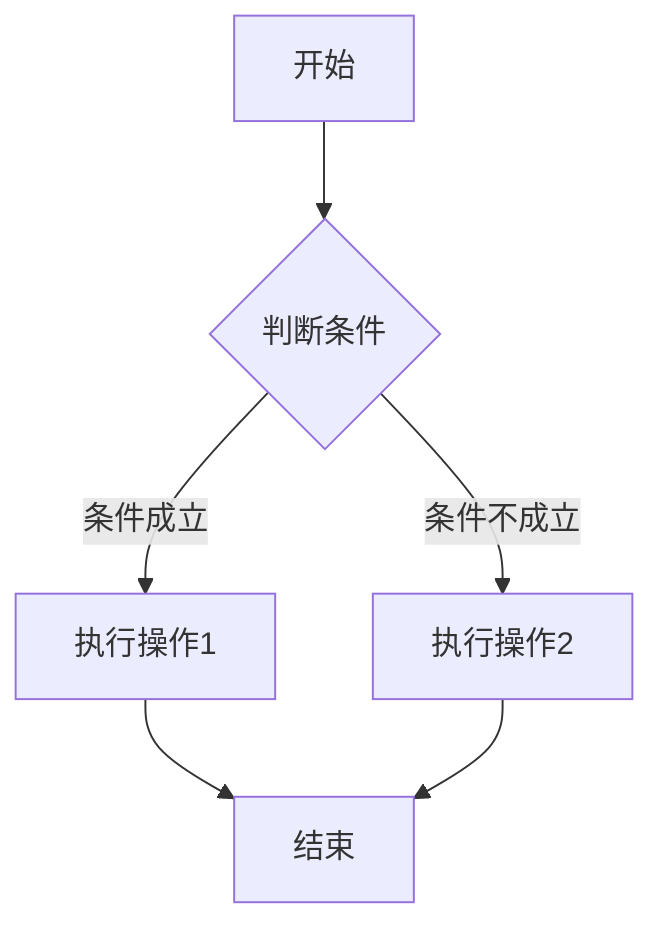
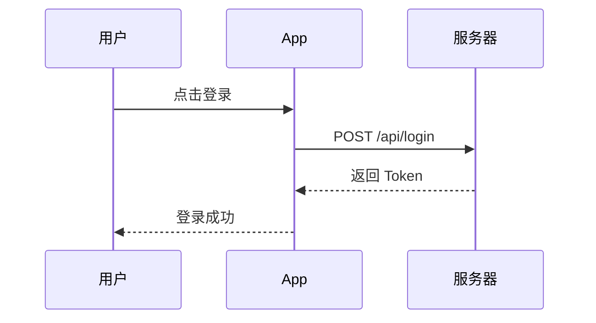

# MKPreview 样式测试模板

本文档用于测试和验证 Markdown 预览的所有样式渲染效果。

---

## 1. 标题层级

# 一级标题 (H1)

## 二级标题 (H2)

### 三级标题 (H3)

#### 四级标题 (H4)

##### 五级标题 (H5)

###### 六级标题 (H6)

---

## 2. 段落与行内元素

这是一段普通文本，包含**加粗文字**、*斜体文字*、~~删除线文字~~，以及 `行内代码`。

还可以使用 ==高亮标记==（若支持）和上标^2^/下标~2~（若支持）。

---

## 3. 无序列表

- 第一层列表项（disc）
  - 第二层列表项（circle）
    - 第三层列表项（square）
      - 第四层列表项（回到 disc）
- 另一个第一层项
  - 嵌套项 A
  - 嵌套项 B

---

## 4. 有序列表

1. 第一层有序项（decimal）
   1. 第二层有序项（decimal 嵌套）
      1. 第三层有序项
2. 字母编号示例（由 CSS 控制层级样式）
   - 实际效果取决于 ol ol 的样式定义

---

## 5. 任务列表

- [x] 已完成的任务项
- [ ] 未完成的任务项
- [x] 另一个已完成项
  - [ ] 嵌套子任务 A
  - [x] 嵌套子任务 B

---

## 6. 引用块

> 这是一段引用文本，应显示左侧蓝色竖线和浅背景。
>
> 引用块可以包含多段内容。

> 嵌套引用示例：
>> 第二层引用块，竖线颜色应变浅。
>>> 第三层引用块，继续变浅。

---

## 7. 代码块

### JavaScript

```javascript
function greet(name) {
  const message = `Hello, ${name}!`;
  console.log(message);
  return message;
}

greet('World');
```

### Python

```python
def fibonacci(n):
    if n <= 1:
        return n
    return fibonacci(n - 1) + fibonacci(n - 2)

for i in range(10):
    print(f"F({i}) = {fibonacci(i)}")
```

### Rust

```rust
fn main() {
    let numbers = vec![1, 2, 3, 4, 5];
    let sum: i32 = numbers.iter().sum();
    println!("Sum: {}", sum);
}
```

### Bash

```bash
#!/bin/bash
set -euo pipefail

echo "Installing dependencies..."
npm install
npm run build

echo "Done!"
```

### TypeScript

```typescript
interface User {
  id: number;
  name: string;
  email?: string;
}

const getUser = async (id: number): Promise<User> => {
  const response = await fetch(`/api/users/${id}`);
  return response.json();
};
```

### 纯文本 / ASCII 框图

```
┌─────────────────┐
│   Hello World   │
└─────────────────┘
```

---

## 8. 表格

| 功能特性 | 支持状态 | 备注说明 |
|:---------|:--------:|:---------|
| 语法高亮 | ✅ | highlight.js 支持 20+ 语言 |
| 代码复制 | ✅ | 一键复制到剪贴板 |
| 行号显示 | ⏳ | 后续版本支持 |
| 暗色主题 | ✅ | 自动跟随系统主题 |

| 语言 | 类型系统 | 适用场景 |
|:-----|:---------|:---------|
| Rust | 静态强类型 | 系统编程、WebAssembly |
| Python | 动态类型 | 数据科学、脚本自动化 |
| TypeScript | 静态类型（渐进） | 前端开发、全栈应用 |

---

## 9. 分隔线

上方是分隔线示例。

---

## 10. 链接

- 内部链接：[跳转到标题层级](#1-标题层级)
- 外部链接：[GitHub](https://github.com)
- 自动链接：https://example.com

---

## 11. 图片


---

## 12. KaTeX 数学公式

行内公式：$E = mc^2$

块级公式：

$$
\int_{-\infty}^{+\infty} e^{-x^2} dx = \sqrt{\pi}
$$

矩阵示例：

$$
\begin{pmatrix}
a & b \\
c & d
\end{pmatrix}
\begin{pmatrix}
x \\
y
\end{pmatrix}
=
\begin{pmatrix}
ax + by \\
cx + dy
\end{pmatrix}
$$

---

## 13. Mermaid 图表





---

## 14. 综合排版测试

> ### 引用中的标题
>
> 引用块内可以包含**加粗**、*斜体*、`代码`和[链接](https://example.com)。
>
> ```python
> # 引用中的代码块
> print("Hello from quote!")
> ```

- 列表项中的 `行内代码`
- 列表项中的 **加粗内容**
- 列表项中的 [链接](https://github.com)

1. 有序列表中的表格（不支持，但作为边界测试）
2. 有序列表中的代码块
   ```json
   {
     "name": "MKPreview",
     "version": "0.1.0"
   }
   ```
